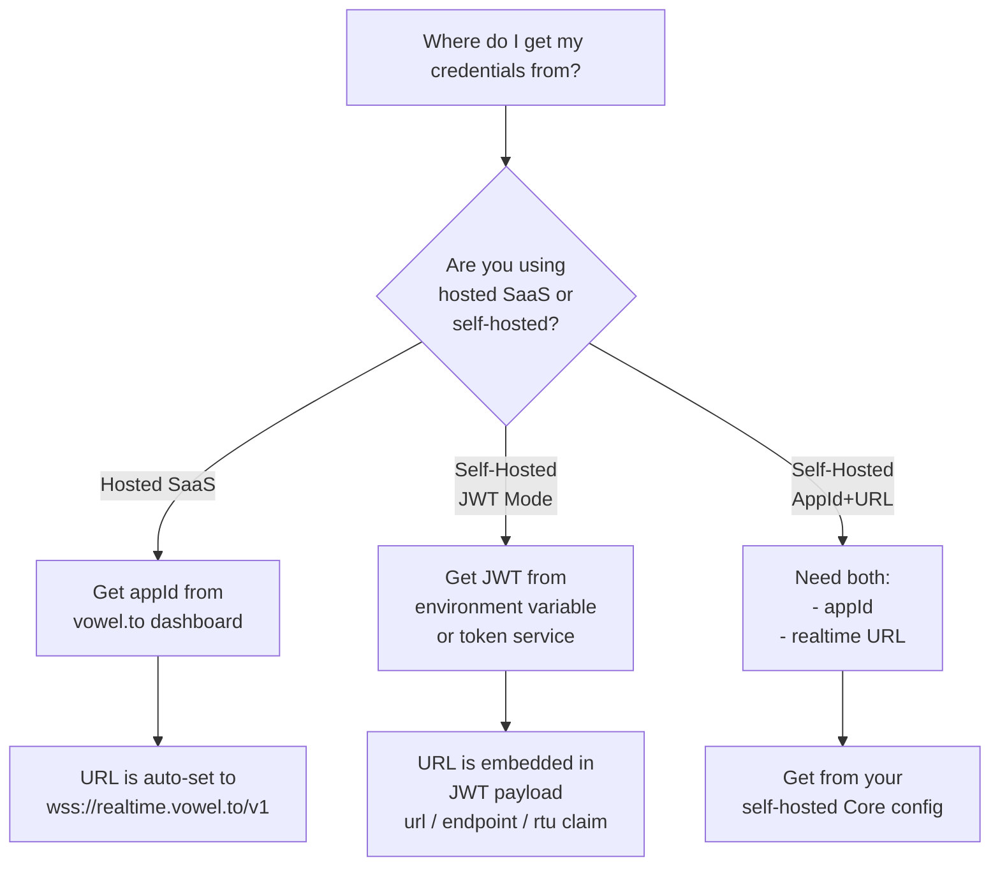

# voweldocs

Use this skill when the task is "add or maintain Vowel inside a documentation site."

Add a voice AI agent to documentation sites, enabling users to navigate, search, and interact with docs using natural voice commands.

## When to Use This Skill

Use voweldocs when:

- You want to understand the pattern for voice-enabling documentation sites
- You want users to navigate pages via voice ("Go to installation guide")
- You want voice-controlled search ("Find the adapter documentation")
- You want to interact with page elements via voice ("Copy the first code example")
- You need automated route detection from markdown files

> **Note on Implementation**: This skill provides an **Astro/Starlight** implementation as the primary example. For other documentation frameworks, use the corresponding Vowel client skill:
> - **VitePress/Vue** → See `platform/vitepress.md`
> - **React (Docusaurus, Nextra)** → See `vowel-react` skill
> - **Python/Rust/Go (MkDocs, Sphinx, mdBook, Hugo)** → See `vowel-webcomponent` skill (web component injection)
> - **Vanilla JS (Docsify, custom)** → See `vowel-vanilla` or `vowel-webcomponent` skill

For Astro/Starlight, this skill is self-contained. Do not require the separate `vowel-react` skill for Astro docs work. Load [platform/astro/astro.md](./platform/astro/astro.md) first.

## Prerequisites

- A documentation site (any static site generator that outputs HTML)
- A vowel.to account or self-hosted vowel stack
- Basic familiarity with Vowel client concepts
- Python with `uv` for RAG prebuild (optional, for semantic search)

## Gitignore Setup

When using the RAG prebuild feature, add these entries to `.gitignore` to exclude downloaded binaries and build state:

```gitignore
# RAG build artifacts - llama.cpp binaries and build state
scripts/llama-*/
scripts/.rag-build-state.yml
scripts/uv.lock
scripts/*.gguf
```

The generated `public/rag-index.yml` and `public/rag-documents.yml` should **not** be gitignored if you want pre-built embeddings in your repository. If you prefer to generate them during CI/CD, add:

```gitignore
# Uncomment to exclude pre-built RAG indices (generate in CI instead)
# public/rag-index.yml
# public/rag-documents.yml
```

## Configuration Decision Tree

Before setup, determine your credential source:



### Credential Summary

| Mode | Required | Source | URL Source |
|------|----------|--------|------------|
| Hosted | `appId` | vowel.to dashboard | Hardcoded: `wss://realtime.vowel.to/v1` |
| Self-hosted (JWT) | `jwt` | Token service or env var | Extracted from JWT payload (`url`/`endpoint`/`rtu` claim) |
| Self-hosted (Manual) | `appId` + `url` | Core configuration | Environment variable or config UI |

## URL Resolution Priority

When using self-hosted mode with JWT, the realtime URL is resolved in this order:

1. **JWT payload** (`url`, `endpoint`, or `rtu` claim)
2. **Environment variable** (framework-specific, e.g., `VITE_VOWEL_URL` for VitePress-based sites)
3. **Fallback placeholder** (your default self-hosted URL)

See your platform-specific guide for exact environment variable names and configuration patterns.

The goal is not a generic voice widget. The goal is to recreate the same VowelDocs-branded docs agent pattern used in this repo:

- same VowelDocs branding and header entrypoint
- same docs-oriented tool quality and action set
- same Astro/Starlight lifecycle workarounds
- same credential modal styling and local-storage behavior
- same runtime defaults such as captions, model, voice, and border glow

Treat this skill as the packaged VowelDocs product spec for supported documentation frameworks. When it fires, the expected outcome is that the target docs site adopts the VowelDocs paradigm, not merely "some Vowel integration."

## Setup Overview

### Step 1: Install Dependencies

```bash
bun add @vowel.to/client @ricky0123/vad-web
```

### Step 2: Create Core Integration

The general pattern for voice-enabling a documentation site involves:

1. **Voice Client Module** - Initialize the Vowel client with documentation-specific actions
2. **Route Discovery** - Generate a manifest of available documentation pages
3. **Navigation Adapter** - Connect voice navigation to your router
4. **Configuration UI** - Allow users to enter credentials (AppId, JWT, or self-hosted URL)

### Step 3: Register Documentation Actions

Documentation sites typically implement these custom actions:

| Action | Purpose | Example Voice Command |
|--------|---------|----------------------|
| `searchDocs` | Trigger search UI | "Search for authentication" |
| `copyCodeExample` | Copy code blocks | "Copy the first code example" |
| `getCurrentPageInfo` | Read page structure | "What sections are on this page?" |
| `navigateToPage` | Route navigation | "Go to the installation guide" |

Framework note:

- Astro/Starlight should adopt the full set of Astro-specific persistence, navigation, audio, and lifecycle workarounds described in [platform/astro/astro.md](./platform/astro/astro.md).
- VitePress should keep its existing lighter-weight platform approach unless a real VitePress-specific issue requires more. Preserve the shared VowelDocs branding and credential-modal style, but do not import Astro-only quirks into VitePress by default.

## Load Order

1. If the docs framework is already known to be Astro or Starlight, read [platform/astro/astro.md](./platform/astro/astro.md) immediately.
2. If the framework is not yet known, read [platform/index.md](./platform/index.md) to choose the correct platform guide.
3. Only read [platform/vitepress.md](./platform/vitepress.md) if the docs site is VitePress.
4. Read [exclusions.md](./exclusions.md) only when evaluating unsupported/static-only frameworks.

## Core Rules

- Prefer a single long-lived Vowel client for the entire docs app.
- Prefer a real framework navigation adapter over custom page reloads.
- Never let Vowel routes use source paths like `/content/docs/...`.
- Generate a canonical route map from the docs source and canonical site origin.
- Regenerate the route map whenever docs files, slugs, sidebar structure, or site origin changes.
- After changing the linked Vowel client package, rebuild that package and then rebuild the docs app.
- Always include the canonical `voweldocs` header button and credential modal UI, with the same storage key, class names, interaction model, and local-storage behavior used in this repo.
- Prefer exact parity with this repo’s shipped VowelDocs experience over framework-specific reinterpretation.

## Astro Workflow

For Astro/Starlight:

- Use the React Vowel client, not the web component wrapper.
- Mount into a persistent host owned by the shared layout.
- Use Astro client navigation from `astro:transitions/client`.
- Set `site` in `astro.config.*` so Astro emits canonical URLs and sitemap output.
- Feed Vowel a generated docs route map with canonical URLs.
- Resume playback after Astro swaps/page loads if transcripts continue but audio goes silent.
- Recreate the `voweldocs` header button and config modal exactly from the canonical implementation in `src/components/voweldocs/voice-widget-init.ts`.

All implementation details, file responsibilities, the shipped source files, and maintenance steps live in [platform/astro/astro.md](./platform/astro/astro.md).

## Route Map Regeneration Rule

Every time you change any of the following, regenerate the docs route map logic and validate it:

- files under `src/content/docs`
- slug structure
- sidebar labels or organization if route discovery depends on sidebar config
- `site` origin in Astro config
- route-generation code

Then run the relevant build commands from [platform/astro/astro.md](./platform/astro/astro.md).

## Reusable Slash Command Prompt

When you want Codex to refresh or recreate the Astro docs voice integration, use this prompt:

```text
/voweldocs-sync Rebuild the Astro/Starlight Vowel docs integration. Regenerate the canonical docs route map, verify Astro site origin and sitemap output, rebuild the linked Vowel client if its source changed, rebuild the docs app, and validate that navigation uses Astro SPA routing without dropping the live session or audio playback.
```

## Deliverables

When using this skill successfully, the resulting docs integration should have:

- one persistent Vowel client
- one persistent UI/audio host
- Astro SPA navigation adapter
- canonical route map for Vowel navigation
- the `voweldocs` header button plus credential modal
- build steps documented and repeatable
- explicit maintenance instructions for route-map regeneration
