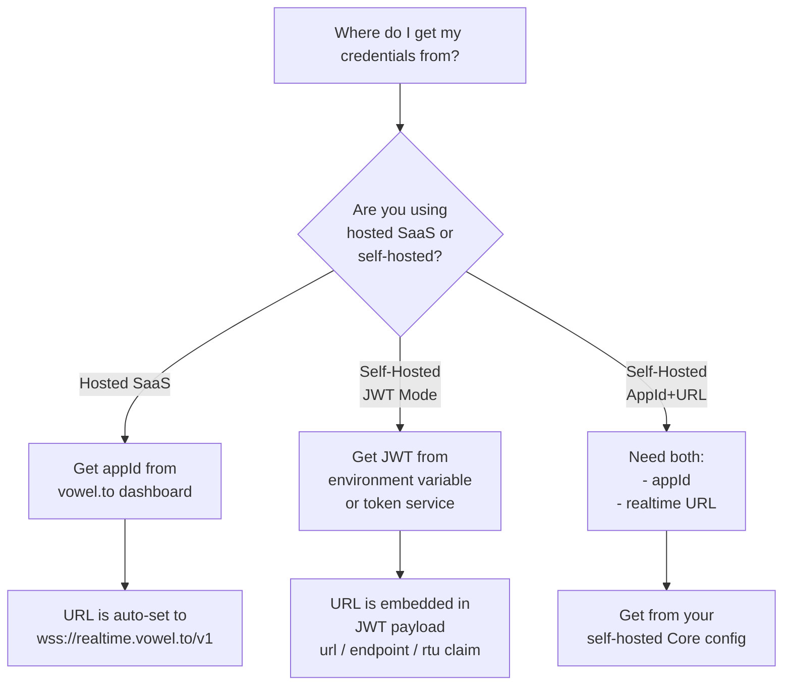

# voweldocs - Voice Agent for Documentation Sites

Add a voice AI agent to documentation sites, enabling users to navigate, search, and interact with docs using natural voice commands.

## When to Use This Skill

Use voweldocs when:

- Building a documentation site with VitePress, Docusaurus, Nextra, VuePress, Docsify, Starlight, or custom setup
- You want users to navigate pages via voice ("Go to installation guide")
- You want voice-controlled search ("Find the adapter documentation")
- You want to interact with page elements via voice ("Copy the first code example")
- You need automated route detection from markdown files

## Prerequisites

- A documentation site (VitePress, Docusaurus, Nextra, VuePress, Docsify, Starlight, or custom)
- A vowel.to account or self-hosted vowel stack
- Basic familiarity with Vowel client concepts

## Configuration Decision Tree

Before setup, determine your credential source:



### Credential Summary

| Mode | Required | Source | URL Source |
|------|----------|--------|------------|
| Hosted | `appId` | vowel.to dashboard | Hardcoded: `wss://realtime.vowel.to/v1` |
| Self-hosted (JWT) | `jwt` | Token service or env var | Extracted from JWT payload (`url`/`endpoint`/`rtu` claim) |
| Self-hosted (Manual) | `appId` + `url` | Core configuration | Environment variable or config UI |

## Setup

### Step 1: Install Dependencies

```bash
bun add @vowel.to/client @ricky0123/vad-web
```

### Step 2: Create Core Files

#### voice-client.ts

Core initialization logic with documentation-specific actions:

```typescript
import { Vowel, createDirectAdapters } from '@vowel.to/client'
import type { Vowel as VowelType, VowelConfig } from '@vowel.to/client'

let vowelInstance: VowelType | null = null

type ConfigMode = 'hosted' | 'selfhosted'

interface HostedConfig { appId: string }
interface SelfHostedConfig { appId?: string; url?: string; jwt?: string }

export interface StoredCredentials {
  mode: ConfigMode
  hosted?: HostedConfig
  selfHosted?: SelfHostedConfig
  timestamp: number
}

const HOSTED_REALTIME_URL = import.meta.env.VITE_VOWEL_URL || 'wss://realtime.vowel.to/v1'

function extractUrlFromJwt(jwt: string): string | null {
  try {
    const parts = jwt.split('.')
    if (parts.length !== 3) return null
    const payload = JSON.parse(atob(parts[1]))
    return payload.url || payload.endpoint || payload.rtu || null
  } catch { return null }
}

function getSelfHostedUrl(jwt: string): string {
  const jwtUrl = extractUrlFromJwt(jwt)
  if (jwtUrl) return jwtUrl
  return import.meta.env.VITE_VOWEL_URL || 'wss://your-instance.com/realtime'
}

export function hasVoiceConfig(): boolean {
  if (typeof window === 'undefined') return false
  try {
    const stored = localStorage.getItem('voweldoc-config')
    if (!stored) return false
    const config: StoredCredentials = JSON.parse(stored)
    const hasHosted = !!config.hosted?.appId
    const hasSelfHostedJwt = !!config.selfHosted?.jwt
    const hasSelfHostedAppUrl = !!(config.selfHosted?.appId && config.selfHosted?.url)
    return hasHosted || hasSelfHostedJwt || hasSelfHostedAppUrl
  } catch { return false }
}

export function getVoiceConfig(): StoredCredentials | null {
  if (typeof window === 'undefined') return null
  try {
    const stored = localStorage.getItem('voweldoc-config')
    return stored ? JSON.parse(stored) as StoredCredentials : null
  } catch { return null }
}

export function clearVoiceConfig(): void {
  if (typeof window === 'undefined') return
  localStorage.removeItem('voweldoc-config')
}

async function getDocRoutes() {
  try {
    const { getRoutes } = await import('./routes-manifest')
    return getRoutes()
  } catch {
    return [{ path: '/', description: 'Home page' }]
  }
}

async function buildVowelConfig(router: any, credentials: StoredCredentials): Promise<VowelConfig> {
  const routes = await getDocRoutes()
  
  const { navigationAdapter, automationAdapter } = createDirectAdapters({
    navigate: async (path: string) => {
      let targetPath = path
      if (targetPath.endsWith('.html')) {
        targetPath = targetPath.slice(0, -5)
      }
      await router.go(targetPath)
    },
    getCurrentPath: () => router.route.path,
    routes,
    enableAutomation: true,
  })

  const baseConfig: Partial<VowelConfig> = {
    navigationAdapter,
    automationAdapter,
    voiceConfig: {
      provider: 'vowel-prime',
      llmProvider: 'groq',
      model: 'openai/gpt-oss-20b',
      voice: 'vowel',
      language: 'en-US',
      turnDetection: { mode: 'server_vad' },
    },
    _caption: { enabled: true, position: 'bottom-center', showRole: true },
    floatingCursor: { enabled: false },
    borderGlow: { enabled: true, color: '#3b82f6', intensity: 20, width: 4, pulse: true },
    systemInstructionOverride: getSystemInstruction(),
  }

  if (credentials.mode === 'hosted' && credentials.hosted) {
    return { ...baseConfig, appId: credentials.hosted.appId, realtimeApiUrl: HOSTED_REALTIME_URL } as VowelConfig
  } else if (credentials.mode === 'selfhosted' && credentials.selfHosted) {
    if (credentials.selfHosted.jwt) {
      const realtimeUrl = getSelfHostedUrl(credentials.selfHosted.jwt)
      return { ...baseConfig, token: credentials.selfHosted.jwt, realtimeApiUrl: realtimeUrl } as VowelConfig
    } else if (credentials.selfHosted.appId && credentials.selfHosted.url) {
      return { ...baseConfig, appId: credentials.selfHosted.appId, realtimeApiUrl: credentials.selfHosted.url } as VowelConfig
    }
  }
  throw new Error('Invalid credentials configuration')
}

function getSystemInstruction(): string {
  return `You are a helpful voice assistant for this documentation site.

Help users by:
1. Answering questions about the documentation
2. Navigating to relevant pages using navigate_to_page
3. Searching for topics
4. Interacting with page elements

Documentation structure:
- Use the navigation adapter to move between pages
- Use custom actions for docs-specific features
- Be concise but helpful in responses`
}

function registerDocsActions(vowel: VowelType) {
  // Search documentation
  vowel.registerAction('searchDocs', {
    description: 'Search the documentation',
    parameters: { query: { type: 'string', description: 'Search query' } }
  }, async ({ query }) => {
    const searchButton = document.querySelector('.DocSearch-Button')
    if (searchButton) {
      ;(searchButton as HTMLElement).click()
      setTimeout(() => {
        const input = document.querySelector('.DocSearch-Input') as HTMLInputElement
        if (input) {
          input.value = query
          input.dispatchEvent(new Event('input', { bubbles: true }))
        }
      }, 300)
    }
    return { success: true }
  })

  // Copy code example
  vowel.registerAction('copyCodeExample', {
    description: 'Copy a code example from the page',
    parameters: { index: { type: 'number', description: 'Code block number (1-based)', optional: true } }
  }, async ({ index = 1 }) => {
    const codeBlocks = document.querySelectorAll('div[class*="language-"]')
    const target = codeBlocks[index - 1]
    if (!target) return { success: false }
    const copyBtn = target.querySelector('.copy') as HTMLElement
    if (copyBtn) copyBtn.click()
    return { success: true }
  })

  // Get current page info
  vowel.registerAction('getCurrentPageInfo', {
    description: 'Get information about the current page',
    parameters: {}
  }, async () => {
    const title = document.querySelector('h1')?.textContent || 'Unknown'
    const headings = Array.from(document.querySelectorAll('h2, h3')).map(h => h.textContent)
    return { success: true, data: { title, sections: headings } }
  })
}

export async function initVoiceAgent(router: any, credentials?: StoredCredentials): Promise<boolean> {
  if (typeof window === 'undefined') return false
  if (vowelInstance) return true

  const config = credentials || getVoiceConfig()
  if (!config) {
    console.warn('No voice configuration found')
    return false
  }

  try {
    const vowelConfig = await buildVowelConfig(router, config)
    vowelInstance = new Vowel(vowelConfig)
    registerDocsActions(vowelInstance)
    console.log('Voice agent initialized')
    return true
  } catch (error) {
    console.error('Failed to initialize voice agent:', error)
    return false
  }
}

export function cleanupVoiceAgent() {
  if (vowelInstance) {
    vowelInstance.stopSession()
    vowelInstance = null
  }
}

export function getVoiceAgent(): VowelType | null {
  return vowelInstance
}
```

#### generate-routes-plugin.ts

Vite plugin for automatic route discovery:

```typescript
import { Plugin } from 'vite'
import fs from 'fs'
import path from 'path'
import { glob } from 'glob'

interface RouteInfo {
  path: string
  description: string
  title?: string
}

function extractMetadata(filePath: string): { title: string; description: string } {
  const content = fs.readFileSync(filePath, 'utf-8')
  const frontmatterMatch = content.match(/^---\n([\s\S]*?)\n---/)
  let title = ''
  
  if (frontmatterMatch) {
    const frontmatter = frontmatterMatch[1]
    const titleMatch = frontmatter.match(/title:\s*["']?([^"'\n]+)["']?/)
    if (titleMatch) title = titleMatch[1]
  }
  
  if (!title) {
    const h1Match = content.match(/^#\s+(.+)$/m)
    if (h1Match) title = h1Match[1]
  }
  
  let description = title
  const paragraphMatch = content.match(/^[^#\n].*$/m)
  if (paragraphMatch) description = paragraphMatch[0].trim().slice(0, 100)
  
  return { title, description }
}

function filePathToUrl(filePath: string, docsDir: string): string {
  let relativePath = path.relative(docsDir, filePath)
  relativePath = relativePath.replace(/\.md$/, '')
  if (relativePath === 'index') return '/'
  relativePath = relativePath.replace(/\/index$/, '')
  return `/${relativePath}.html`
}

export function generateRoutesPlugin(): Plugin {
  return {
    name: 'vowel-generate-routes',
    async buildStart() {
      const docsDir = path.resolve(__dirname, '..', '..')
      const markdownFiles = await glob('**/*.md', {
        cwd: docsDir,
        ignore: ['**/node_modules/**', '**/.vitepress/**', '**/README.md'],
        absolute: true
      })
      
      const routes: RouteInfo[] = []
      for (const file of markdownFiles) {
        const { title, description } = extractMetadata(file)
        const urlPath = filePathToUrl(file, docsDir)
        routes.push({ path: urlPath, description: title ? `${title} - ${description}` : description, title })
      }
      routes.sort((a, b) => a.path.localeCompare(b.path))
      
      const routesFileContent = `export interface VowelRoute { path: string; description: string; title?: string }
export const ROUTES: VowelRoute[] = ${JSON.stringify(routes, null, 2)}
export function getRoutes(): VowelRoute[] { return ROUTES }
export function getRouteByPath(path: string): VowelRoute | undefined {
  return ROUTES.find(r => r.path === path || r.path === path + '.html' || r.path + '.html' === path)
}`
      
      const outputPath = path.resolve(__dirname, 'routes-manifest.ts')
      fs.writeFileSync(outputPath, routesFileContent, 'utf-8')
      console.log(`Generated ${routes.length} routes for voice navigation`)
    }
  }
}
```

#### VoiceLayout.vue

Vue layout component integrating voice UI:

```vue
<template>
  <Layout>
    <template #nav-bar-content-before>
      <button class="voice-config-btn" @click="openConfigModal" :class="{ 'has-config': hasStoredConfig }">
        <span>voice</span>
      </button>
    </template>
    <template #layout-bottom>
      <VoiceAgent v-if="voiceEnabled" />
    </template>
  </Layout>
  <VoiceConfigModal v-model="showConfigModal" @configured="onVoiceConfigured" @cleared="onVoiceCleared" />
</template>

<script setup lang="ts">
import { ref, onMounted, onUnmounted } from 'vue'
import { useRouter } from 'vitepress'
import DefaultTheme from 'vitepress/theme'
import VoiceAgent from './VoiceAgent.vue'
import VoiceConfigModal from './VoiceConfigModal.vue'
import { initVoiceAgent, cleanupVoiceAgent, hasVoiceConfig, type StoredCredentials } from './voice-client'

const { Layout } = DefaultTheme
const router = useRouter()
const showConfigModal = ref(false)
const hasStoredConfig = ref(false)
const voiceEnabled = ref(false)

function openConfigModal() { showConfigModal.value = true }

async function onVoiceConfigured(credentials: StoredCredentials) {
  hasStoredConfig.value = true
  const success = await initVoiceAgent(router, credentials)
  voiceEnabled.value = success
}

function onVoiceCleared() {
  hasStoredConfig.value = false
  voiceEnabled.value = false
  cleanupVoiceAgent()
}

onMounted(async () => {
  const hasConfig = hasVoiceConfig()
  hasStoredConfig.value = hasConfig
  if (hasConfig) {
    const success = await initVoiceAgent(router)
    voiceEnabled.value = success
  }
})

onUnmounted(() => cleanupVoiceAgent())
</script>
```

#### VoiceConfigModal.vue

Modal component for entering voice agent credentials (AppId, JWT, or self-hosted URL):

```vue
<template>
  <Teleport to="body">
    <Transition name="modal-fade">
      <div v-if="isOpen" class="vowel-config-modal-overlay" @click.self="closeModal">
        <div class="vowel-config-modal">
          <div class="modal-header">
            <h2>Configure <span class="vowel-brand">voweldocs</span></h2>
            <button class="close-btn" @click="closeModal" aria-label="Close">
              <svg xmlns="http://www.w3.org/2000/svg" width="20" height="20" viewBox="0 0 24 24" fill="none" stroke="currentColor" stroke-width="2" stroke-linecap="round" stroke-linejoin="round">
                <line x1="18" y1="6" x2="6" y2="18"></line>
                <line x1="6" y1="6" x2="18" y2="18"></line>
              </svg>
            </button>
          </div>

          <div class="modal-body">
            <p class="modal-description">
              Enter your vowel credentials to enable voice navigation.
              Get credentials from <a href="https://vowel.to" target="_blank" rel="noopener">vowel.to</a> (SaaS) or your <a href="https://docs.vowel.to/self-hosted" target="_blank" rel="noopener">self-hosted</a> instance.
            </p>

            <!-- Mode Toggle -->
            <div class="mode-toggle">
              <button
                :class="['mode-btn', { active: mode === 'hosted' }]"
                @click="mode = 'hosted'"
                type="button"
              >
                Hosted (SaaS)
              </button>
              <button
                :class="['mode-btn', { active: mode === 'selfhosted' }]"
                @click="mode = 'selfhosted'"
                type="button"
              >
                Self-Hosted
              </button>
            </div>

            <!-- Hosted Mode Form -->
            <form v-if="mode === 'hosted'" @submit.prevent="saveHostedConfig">
              <div class="form-group">
                <label for="app-id">App ID</label>
                <div class="password-input-wrapper">
                  <input
                    id="app-id"
                    v-model="hostedConfig.appId"
                    :type="showHostedAppId ? 'text' : 'password'"
                    placeholder="your-app-id"
                    required
                  />
                  <button
                    type="button"
                    class="toggle-visibility-btn"
                    @click="showHostedAppId = !showHostedAppId"
                    :aria-label="showHostedAppId ? 'Hide App ID' : 'Show App ID'"
                  >
                    <svg v-if="showHostedAppId" xmlns="http://www.w3.org/2000/svg" width="18" height="18" viewBox="0 0 24 24" fill="none" stroke="currentColor" stroke-width="2" stroke-linecap="round" stroke-linejoin="round">
                      <path d="M2 12s3-7 10-7 10 7 10 7-3 7-10 7-10-7-10-7Z"></path>
                      <circle cx="12" cy="12" r="3"></circle>
                    </svg>
                    <svg v-else xmlns="http://www.w3.org/2000/svg" width="18" height="18" viewBox="0 0 24 24" fill="none" stroke="currentColor" stroke-width="2" stroke-linecap="round" stroke-linejoin="round">
                      <path d="M9.88 9.88a3 3 0 1 0 4.24 4.24"></path>
                      <path d="M10.73 5.08A10.43 10.43 0 0 1 12 5c7 0 10 7 10 7a13.16 13.16 0 0 1-1.67 2.68"></path>
                      <path d="M6.61 6.61A13.526 13.526 0 0 0 2 12s3 7 10 7a9.74 9.74 0 0 0 5.39-1.61"></path>
                      <line x1="2" x2="22" y1="2" y2="22"></line>
                    </svg>
                  </button>
                </div>
                <span class="hint">Your vowel application ID from <a href="https://vowel.to" target="_blank" rel="noopener">vowel.to</a></span>
              </div>

              <div class="form-actions">
                <button type="submit" class="btn-primary" :disabled="!isHostedValid">
                  Save & Enable voweldocs
                </button>
                <button
                  v-if="hasStoredConfig && mode === 'hosted'"
                  type="button"
                  class="btn-danger"
                  @click="confirmRemoveModeConfig('hosted')"
                >
                  Remove
                </button>
              </div>
            </form>

            <!-- Self-Hosted Mode Form -->
            <form v-else @submit.prevent="saveSelfHostedConfig">
              <!-- JWT Mode: determined by VITE_VOWEL_USE_JWT env var -->
              <div v-if="useJwtFromEnv">
                <div class="form-group">
                  <label for="jwt-token">JWT Token</label>
                  <textarea
                    id="jwt-token"
                    v-model="selfHostedConfig.jwt"
                    rows="3"
                    placeholder="eyJhbGciOiJIUzI1NiIs..."
                    required
                  ></textarea>
                  <span class="hint">Server-signed JWT token. URL is auto-detected from the JWT payload.</span>
                </div>

                <div class="form-group readonly-field" v-if="extractedJwtUrl">
                  <label>Detected Realtime URL</label>
                  <div class="readonly-value">
                    <code>{{ extractedJwtUrl }}</code>
                  </div>
                  <span class="hint">Extracted from JWT payload</span>
                </div>
              </div>

              <!-- Default Mode: App ID + URL -->
              <template v-else>
                <div class="form-group">
                  <label for="selfhosted-app-id">App ID</label>
                  <div class="password-input-wrapper">
                    <input
                      id="selfhosted-app-id"
                      v-model="selfHostedConfig.appId"
                      :type="showSelfHostedAppId ? 'text' : 'password'"
                      placeholder="your-app-id"
                      required
                    />
                    <button
                      type="button"
                      class="toggle-visibility-btn"
                      @click="showSelfHostedAppId = !showSelfHostedAppId"
                      :aria-label="showSelfHostedAppId ? 'Hide App ID' : 'Show App ID'"
                    >
                      <svg v-if="showSelfHostedAppId" xmlns="http://www.w3.org/2000/svg" width="18" height="18" viewBox="0 0 24 24" fill="none" stroke="currentColor" stroke-width="2" stroke-linecap="round" stroke-linejoin="round">
                        <path d="M2 12s3-7 10-7 10 7 10 7-3 7-10 7-10-7-10-7Z"></path>
                        <circle cx="12" cy="12" r="3"></circle>
                      </svg>
                      <svg v-else xmlns="http://www.w3.org/2000/svg" width="18" height="18" viewBox="0 0 24 24" fill="none" stroke="currentColor" stroke-width="2" stroke-linecap="round" stroke-linejoin="round">
                        <path d="M9.88 9.88a3 3 0 1 0 4.24 4.24"></path>
                        <path d="M10.73 5.08A10.43 10.43 0 0 1 12 5c7 0 10 7 10 7a13.16 13.16 0 0 1-1.67 2.68"></path>
                        <path d="M6.61 6.61A13.526 13.526 0 0 0 2 12s3 7 10 7a9.74 9.74 0 0 0 5.39-1.61"></path>
                        <line x1="2" x2="22" y1="2" y2="22"></line>
                      </svg>
                    </button>
                  </div>
                  <span class="hint">Your self-hosted application ID</span>
                </div>

                <div class="form-group">
                  <label for="selfhosted-url">Realtime URL</label>
                  <input
                    id="selfhosted-url"
                    v-model="selfHostedConfig.url"
                    type="text"
                    placeholder="wss://your-instance.com/realtime"
                    required
                  />
                  <span class="hint">Your self-hosted realtime endpoint</span>
                </div>
              </template>

              <div class="form-actions">
                <button type="submit" class="btn-primary" :disabled="!isSelfHostedValid">
                  Save & Enable voweldocs
                </button>
                <button
                  v-if="hasStoredConfig && mode === 'selfhosted'"
                  type="button"
                  class="btn-danger"
                  @click="confirmRemoveModeConfig('selfhosted')"
                >
                  Remove
                </button>
              </div>
            </form>

            <!-- Error Message -->
            <div v-if="errorMessage" class="error-message">
              {{ errorMessage }}
            </div>

            <!-- Success Message -->
            <div v-if="successMessage" class="success-message">
              {{ successMessage }}
            </div>
          </div>

          <!-- Confirmation Dialog -->
          <div v-if="showConfirmDialog" class="confirm-dialog-overlay" @click.self="cancelConfirm">
            <div class="confirm-dialog">
              <h3 class="confirm-title">{{ confirmTitle }}</h3>
              <p class="confirm-message">{{ confirmMessage }}</p>
              <div class="confirm-actions">
                <button class="btn-secondary" @click="cancelConfirm">
                  Cancel
                </button>
                <button class="btn-danger" @click="executeConfirmedAction">
                  {{ confirmButtonText }}
                </button>
              </div>
            </div>
          </div>

          <div class="modal-footer">
            <button class="btn-secondary" @click="clearConfig" v-if="hasStoredConfig">
              Clear Saved Config
            </button>
            <span class="help-text">
              Credentials are stored locally in your browser.
            </span>
          </div>
        </div>
      </div>
    </Transition>
  </Teleport>
</template>

<script setup lang="ts">
import { ref, computed, onMounted, watch } from 'vue'

/**
 * Configuration modes for vowel voice agent
 */
type ConfigMode = 'hosted' | 'selfhosted'

/**
 * Hosted (SaaS) configuration - URL is hardcoded
 */
interface HostedConfig {
  appId: string
}

/**
 * Self-hosted configuration - supports appId + URL (default) or JWT (alternative)
 */
interface SelfHostedConfig {
  appId: string
  url: string
  jwt: string
}

/**
 * Stored credentials format
 */
interface StoredCredentials {
  mode: ConfigMode
  hosted?: {
    appId: string
  }
  selfHosted?: {
    appId?: string
    url?: string
    jwt?: string
  }
  timestamp: number
}

// Props
interface Props {
  modelValue: boolean
}

const props = defineProps<Props>()

// Emits
const emit = defineEmits<{
  'update:modelValue': [value: boolean]
  'configured': [credentials: StoredCredentials]
  'cleared': []
}>()

// Local state
const isOpen = computed({
  get: () => props.modelValue,
  set: (value) => emit('update:modelValue', value)
})

const mode = ref<ConfigMode>('hosted')
const errorMessage = ref('')
const successMessage = ref('')
const hasStoredConfig = ref(false)

// Confirmation dialog state
const showConfirmDialog = ref(false)
const confirmTitle = ref('')
const confirmMessage = ref('')
const confirmButtonText = ref('')
const pendingConfirmAction = ref<(() => void) | null>(null)

// Visibility toggles for password fields
const showHostedAppId = ref(false)
const showSelfHostedAppId = ref(false)

const hostedConfig = ref<HostedConfig>({
  appId: ''
})

const selfHostedConfig = ref<SelfHostedConfig>({
  appId: '',
  url: '',
  jwt: ''
})

// JWT mode is determined by environment variable - not a user toggle
const useJwtFromEnv = computed(() => {
  return import.meta.env.VITE_VOWEL_USE_JWT === 'true'
})

// Extract URL from JWT for display purposes
const extractedJwtUrl = computed(() => {
  if (!selfHostedConfig.value.jwt) return null
  try {
    const parts = selfHostedConfig.value.jwt.split('.')
    if (parts.length !== 3) return null
    const payload = JSON.parse(atob(parts[1]))
    return payload.url || payload.endpoint || payload.rtu || null
  } catch {
    return null
  }
})

// Validation
const isHostedValid = computed(() => {
  return hostedConfig.value.appId.trim()
})

const isSelfHostedValid = computed(() => {
  if (useJwtFromEnv.value) {
    // JWT mode: need a valid JWT format
    const jwt = selfHostedConfig.value.jwt.trim()
    if (!jwt) return false
    return jwt.includes('.') && jwt.split('.').length === 3
  }
  // Default mode: need both appId and URL
  return selfHostedConfig.value.appId.trim() && selfHostedConfig.value.url.trim()
})

// Clear messages when mode changes
watch(mode, () => {
  errorMessage.value = ''
  successMessage.value = ''
})

/**
 * Check for environment-provided config on mount
 */
onMounted(() => {
  loadStoredConfig()
  checkEnvConfig()
})

/**
 * Check for environment config (JWT or self-hosted URL)
 */
function checkEnvConfig() {
  // Check for JWT from environment (only relevant if USE_JWT is true)
  const envJwt = import.meta.env.VITE_VOWEL_JWT_TOKEN
  if (envJwt) {
    if (useJwtFromEnv.value) {
      selfHostedConfig.value.jwt = envJwt
    }
  }

  // Check for custom URL from environment (for self-hosted mode)
  const envUrl = import.meta.env.VITE_VOWEL_URL
  if (envUrl) {
    selfHostedConfig.value.url = envUrl
  }
}

/**
 * Load stored configuration from localStorage
 */
function loadStoredConfig() {
  if (typeof window === 'undefined') return

  try {
    const stored = localStorage.getItem('voweldoc-config')
    if (stored) {
      const parsed: StoredCredentials = JSON.parse(stored)
      hasStoredConfig.value = true

      // Restore values
      mode.value = parsed.mode
      if (parsed.mode === 'hosted' && parsed.hosted) {
        hostedConfig.value.appId = parsed.hosted.appId || ''
      } else if (parsed.mode === 'selfhosted' && parsed.selfHosted) {
        // Restore based on what's stored (JWT mode or appId+URL mode)
        if (parsed.selfHosted.jwt) {
          selfHostedConfig.value.jwt = parsed.selfHosted.jwt
        } else {
          selfHostedConfig.value.appId = parsed.selfHosted.appId || ''
          selfHostedConfig.value.url = parsed.selfHosted.url || ''
        }
      }
    }
  } catch (error) {
    console.error('Error loading stored config:', error)
  }
}

/**
 * Save hosted configuration
 */
function saveHostedConfig() {
  errorMessage.value = ''
  successMessage.value = ''

  if (!isHostedValid.value) {
    errorMessage.value = 'Please provide an App ID'
    return
  }

  const credentials: StoredCredentials = {
    mode: 'hosted',
    hosted: {
      appId: hostedConfig.value.appId
      // URL is hardcoded, not stored
    },
    timestamp: Date.now()
  }

  saveToStorage(credentials)
}

/**
 * Save self-hosted configuration
 */
function saveSelfHostedConfig() {
  errorMessage.value = ''
  successMessage.value = ''

  if (!isSelfHostedValid.value) {
    if (useJwtFromEnv.value) {
      errorMessage.value = 'Please provide a valid JWT token'
    } else {
      errorMessage.value = 'Please provide both App ID and Realtime URL'
    }
    return
  }

  const credentials: StoredCredentials = {
    mode: 'selfhosted',
    selfHosted: useJwtFromEnv.value
      ? { jwt: selfHostedConfig.value.jwt.trim() }
      : {
          appId: selfHostedConfig.value.appId.trim(),
          url: selfHostedConfig.value.url.trim()
        },
    timestamp: Date.now()
  }

  saveToStorage(credentials)
}

/**
 * Save credentials to localStorage
 */
function saveToStorage(credentials: StoredCredentials) {
  try {
    localStorage.setItem('voweldoc-config', JSON.stringify(credentials))
    hasStoredConfig.value = true
    successMessage.value = 'Configuration saved! Voice agent is now enabled.'

    // Emit event for parent to initialize voice client
    emit('configured', credentials)

    // Close modal after a short delay
    setTimeout(() => {
      closeModal()
    }, 1500)
  } catch (error) {
    errorMessage.value = 'Failed to save configuration. Storage may be disabled.'
    console.error('Error saving config:', error)
  }
}

/**
 * Show confirmation dialog for removing mode-specific configuration
 */
function confirmRemoveModeConfig(modeToRemove: ConfigMode) {
  confirmTitle.value = 'Remove Configuration'
  confirmMessage.value = `Are you sure you want to remove your saved ${modeToRemove === 'hosted' ? 'Hosted (SaaS)' : 'Self-Hosted'} configuration? This will clear the stored credentials from local storage.`
  confirmButtonText.value = 'Remove'
  pendingConfirmAction.value = () => removeModeConfig(modeToRemove)
  showConfirmDialog.value = true
}

/**
 * Cancel the confirmation dialog
 */
function cancelConfirm() {
  showConfirmDialog.value = false
  pendingConfirmAction.value = null
}

/**
 * Execute the confirmed action
 */
function executeConfirmedAction() {
  if (pendingConfirmAction.value) {
    pendingConfirmAction.value()
  }
  showConfirmDialog.value = false
  pendingConfirmAction.value = null
}

/**
 * Remove configuration for a specific mode only
 */
function removeModeConfig(modeToRemove: ConfigMode) {
  try {
    // Get current stored config
    const stored = localStorage.getItem('voweldoc-config')
    if (!stored) return

    const parsed: StoredCredentials = JSON.parse(stored)

    // If stored mode matches the mode being removed, clear everything
    if (parsed.mode === modeToRemove) {
      localStorage.removeItem('voweldoc-config')
      hasStoredConfig.value = false
      successMessage.value = 'Configuration removed. Voice agent disabled.'
      emit('cleared')
    } else {
      // Stored mode is different from the one being removed
      // Just clear the form fields for current mode
      successMessage.value = `${modeToRemove === 'hosted' ? 'Hosted' : 'Self-Hosted'} form cleared.`
    }

    // Clear form fields for the removed mode
    if (modeToRemove === 'hosted') {
      hostedConfig.value = { appId: '' }
    } else {
      selfHostedConfig.value = { appId: '', url: '', jwt: '' }
    }

    setTimeout(() => {
      successMessage.value = ''
    }, 2000)
  } catch (error) {
    errorMessage.value = 'Failed to remove configuration.'
    console.error('Error removing mode config:', error)
  }
}

/**
 * Clear stored configuration (all modes)
 */
function clearConfig() {
  try {
    localStorage.removeItem('voweldoc-config')
    hasStoredConfig.value = false
    hostedConfig.value = { appId: '' }
    selfHostedConfig.value = { appId: '', url: '', jwt: '' }
    successMessage.value = 'Configuration cleared. Voice agent disabled.'
    emit('cleared')

    setTimeout(() => {
      closeModal()
    }, 1500)
  } catch (error) {
    console.error('Error clearing config:', error)
  }
}

/**
 * Close the modal
 */
function closeModal() {
  isOpen.value = false
  // Clear messages when closing
  setTimeout(() => {
    errorMessage.value = ''
    successMessage.value = ''
  }, 300)
}

/**
 * Expose method to check if config exists (for external use)
 */
defineExpose({
  hasConfig: () => hasStoredConfig.value,
  getConfig: () => {
    if (typeof window === 'undefined') return null
    const stored = localStorage.getItem('voweldoc-config')
    return stored ? JSON.parse(stored) as StoredCredentials : null
  }
})
</script>

<style scoped>
.vowel-config-modal-overlay {
  position: fixed;
  inset: 0;
  background: rgba(0, 0, 0, 0.6);
  backdrop-filter: blur(4px);
  display: flex;
  align-items: center;
  justify-content: center;
  z-index: 99999;
  padding: 1rem;
}

.vowel-config-modal {
  background: var(--vp-c-bg);
  border-radius: 12px;
  box-shadow: 0 20px 60px rgba(0, 0, 0, 0.3);
  width: 100%;
  max-width: 480px;
  max-height: 90vh;
  overflow-y: auto;
  border: 1px solid var(--vp-c-divider);
}

.modal-header {
  display: flex;
  align-items: center;
  justify-content: space-between;
  padding: 1.25rem 1.5rem;
  border-bottom: 1px solid var(--vp-c-divider);
}

.modal-header h2 {
  margin: 0;
  font-size: 1.25rem;
  font-weight: 600;
  color: var(--vp-c-text-1);
}

.vowel-brand {
  font-family: 'OCR-A', 'Courier New', monospace;
  font-weight: normal;
  letter-spacing: 0.05em;
}

.close-btn {
  background: none;
  border: none;
  color: var(--vp-c-text-2);
  cursor: pointer;
  padding: 0.25rem;
  border-radius: 6px;
  display: flex;
  align-items: center;
  justify-content: center;
  transition: all 0.2s;
}

.close-btn:hover {
  color: var(--vp-c-text-1);
  background: var(--vp-c-bg-soft);
}

.modal-body {
  padding: 1.5rem;
}

.modal-description {
  margin: 0 0 1.25rem;
  font-size: 0.875rem;
  line-height: 1.5;
  color: var(--vp-c-text-2);
}

.modal-description a {
  color: var(--vp-c-brand-1);
  text-decoration: none;
}

.modal-description a:hover {
  text-decoration: underline;
}

.mode-toggle {
  display: flex;
  gap: 0.5rem;
  margin-bottom: 1.25rem;
  background: var(--vp-c-bg-soft);
  padding: 0.25rem;
  border-radius: 8px;
}

.mode-btn {
  flex: 1;
  padding: 0.625rem 1rem;
  border: none;
  background: transparent;
  color: var(--vp-c-text-2);
  font-size: 0.875rem;
  font-weight: 500;
  border-radius: 6px;
  cursor: pointer;
  transition: all 0.2s;
}

.mode-btn:hover {
  color: var(--vp-c-text-1);
}

.mode-btn.active {
  background: var(--vp-c-bg);
  color: var(--vp-c-brand-1);
  box-shadow: 0 1px 3px rgba(0, 0, 0, 0.1);
}

.form-group {
  margin-bottom: 1rem;
}

.form-group label {
  display: block;
  font-size: 0.875rem;
  font-weight: 500;
  color: var(--vp-c-text-1);
  margin-bottom: 0.375rem;
}

.form-group input,
.form-group textarea {
  width: 100%;
  padding: 0.625rem 0.875rem;
  border: 1px solid var(--vp-c-divider);
  border-radius: 6px;
  background: var(--vp-c-bg);
  color: var(--vp-c-text-1);
  font-size: 0.875rem;
  transition: border-color 0.2s, box-shadow 0.2s;
  font-family: var(--vp-font-family-base);
}

.form-group input:focus,
.form-group textarea:focus {
  outline: none;
  border-color: var(--vp-c-brand-1);
  box-shadow: 0 0 0 3px var(--vp-c-brand-soft);
}

.form-group textarea {
  resize: vertical;
  min-height: 80px;
  font-family: var(--vp-font-family-mono);
  font-size: 0.8125rem;
}

.form-group .hint {
  display: block;
  margin-top: 0.375rem;
  font-size: 0.75rem;
  color: var(--vp-c-text-3);
}

/* Password input with eye toggle */
.password-input-wrapper {
  position: relative;
  display: flex;
  align-items: center;
}

.password-input-wrapper input {
  padding-right: 2.75rem;
}

.toggle-visibility-btn {
  position: absolute;
  right: 0.5rem;
  top: 50%;
  transform: translateY(-50%);
  background: transparent;
  border: none;
  padding: 0.375rem;
  cursor: pointer;
  color: var(--vp-c-text-2);
  display: flex;
  align-items: center;
  justify-content: center;
  border-radius: 4px;
  transition: all 0.2s;
}

.toggle-visibility-btn:hover {
  color: var(--vp-c-text-1);
  background: var(--vp-c-bg-soft);
}

.toggle-visibility-btn:focus {
  outline: none;
  box-shadow: 0 0 0 2px var(--vp-c-brand-soft);
}

.form-actions {
  margin-top: 1.25rem;
  display: flex;
  gap: 0.75rem;
}

.form-actions .btn-primary,
.form-actions .btn-danger {
  flex: 1;
}

.btn-primary {
  width: 100%;
  padding: 0.75rem 1rem;
  background: var(--vp-c-brand-1);
  color: white;
  border: none;
  border-radius: 6px;
  font-size: 0.875rem;
  font-weight: 600;
  cursor: pointer;
  transition: background 0.2s, transform 0.1s, opacity 0.2s;
  box-shadow: 0 1px 3px rgba(0, 0, 0, 0.1);
}

.btn-primary:hover:not(:disabled) {
  background: var(--vp-c-brand-2);
  box-shadow: 0 2px 4px rgba(0, 0, 0, 0.15);
}

.btn-primary:active:not(:disabled) {
  transform: translateY(1px);
  box-shadow: 0 1px 2px rgba(0, 0, 0, 0.1);
}

.btn-primary:disabled {
  background: var(--vp-c-brand-3);
  opacity: 0.6;
  cursor: not-allowed;
  box-shadow: none;
}

.error-message {
  margin-top: 1rem;
  padding: 0.75rem 1rem;
  background: var(--vp-c-danger-soft);
  color: var(--vp-c-danger-1);
  border-radius: 6px;
  font-size: 0.875rem;
}

.success-message {
  margin-top: 1rem;
  padding: 0.75rem 1rem;
  background: var(--vp-c-success-soft);
  color: var(--vp-c-success-1);
  border-radius: 6px;
  font-size: 0.875rem;
}

.modal-footer {
  display: flex;
  align-items: center;
  justify-content: space-between;
  padding: 1rem 1.5rem;
  border-top: 1px solid var(--vp-c-divider);
  background: var(--vp-c-bg-soft);
  border-radius: 0 0 12px 12px;
}

.btn-secondary {
  padding: 0.5rem 0.875rem;
  background: transparent;
  color: var(--vp-c-text-2);
  border: 1px solid var(--vp-c-divider);
  border-radius: 6px;
  font-size: 0.8125rem;
  cursor: pointer;
  transition: all 0.2s;
}

.btn-secondary:hover {
  color: var(--vp-c-danger-1);
  border-color: var(--vp-c-danger-1);
}

.help-text {
  font-size: 0.75rem;
  color: var(--vp-c-text-3);
}

/* Transitions */
.modal-fade-enter-active,
.modal-fade-leave-active {
  transition: opacity 0.3s ease;
}

.modal-fade-enter-from,
.modal-fade-leave-to {
  opacity: 0;
}

.modal-fade-enter-active .vowel-config-modal,
.modal-fade-leave-active .vowel-config-modal {
  transition: transform 0.3s ease, opacity 0.3s ease;
}

.modal-fade-enter-from .vowel-config-modal,
.modal-fade-leave-to .vowel-config-modal {
  transform: translateY(-20px) scale(0.95);
  opacity: 0;
}

/* Dark mode adjustments */
:root.dark .vowel-config-modal {
  box-shadow: 0 20px 60px rgba(0, 0, 0, 0.5);
}

/* Readonly field styling */
.readonly-field {
  opacity: 0.8;
}

.readonly-value {
  padding: 0.625rem 0.875rem;
  background: var(--vp-c-bg-soft);
  border: 1px solid var(--vp-c-divider);
  border-radius: 6px;
  font-family: var(--vp-font-family-mono);
  font-size: 0.8125rem;
  color: var(--vp-c-text-2);
}

.readonly-value code {
  background: transparent;
  padding: 0;
  font-size: inherit;
  color: inherit;
}

/* Danger/Remove button */
.btn-danger {
  width: 100%;
  padding: 0.75rem 1rem;
  background: transparent;
  color: var(--vp-c-danger-1);
  border: 1px solid var(--vp-c-danger-1);
  border-radius: 6px;
  font-size: 0.875rem;
  font-weight: 600;
  cursor: pointer;
  transition: all 0.2s;
}

.btn-danger:hover {
  background: var(--vp-c-danger-soft);
}

.btn-danger:active {
  transform: translateY(1px);
}

/* Confirmation Dialog */
.confirm-dialog-overlay {
  position: fixed;
  inset: 0;
  background: rgba(0, 0, 0, 0.6);
  backdrop-filter: blur(4px);
  display: flex;
  align-items: center;
  justify-content: center;
  z-index: 100000;
  padding: 1rem;
  animation: fadeIn 0.2s ease;
}

.confirm-dialog {
  background: var(--vp-c-bg);
  border-radius: 12px;
  box-shadow: 0 20px 60px rgba(0, 0, 0, 0.3);
  width: 100%;
  max-width: 400px;
  padding: 1.5rem;
  border: 1px solid var(--vp-c-divider);
  animation: scaleIn 0.2s ease;
}

.confirm-title {
  margin: 0 0 0.75rem;
  font-size: 1.125rem;
  font-weight: 600;
  color: var(--vp-c-text-1);
}

.confirm-message {
  margin: 0 0 1.5rem;
  font-size: 0.875rem;
  line-height: 1.5;
  color: var(--vp-c-text-2);
}

.confirm-actions {
  display: flex;
  gap: 0.75rem;
  justify-content: flex-end;
}

.confirm-actions .btn-secondary {
  padding: 0.625rem 1rem;
  font-size: 0.875rem;
}

.confirm-actions .btn-danger {
  width: auto;
  padding: 0.625rem 1rem;
  font-size: 0.875rem;
}

@keyframes fadeIn {
  from { opacity: 0; }
  to { opacity: 1; }
}

@keyframes scaleIn {
  from {
    opacity: 0;
    transform: scale(0.95);
  }
  to {
    opacity: 1;
    transform: scale(1);
  }
}

/* Dark mode adjustments */
:root.dark .confirm-dialog {
  box-shadow: 0 20px 60px rgba(0, 0, 0, 0.5);
}
</style>
```

#### VoiceAgent.vue

Vue wrapper component that mounts the Vowel voice widget:

```vue
<template>
  <div ref="containerRef"></div>
</template>

<script setup lang="ts">
import { ref, onMounted, onUnmounted } from 'vue'
import { getVoiceAgent } from './voice-client'

const containerRef = ref<HTMLElement | null>(null)
let agent: any = null

onMounted(() => {
  // Get the initialized voice agent and mount it
  agent = getVoiceAgent()
  if (agent && containerRef.value) {
    // The agent UI is automatically rendered by the Vowel client
    // This container serves as the mount point for any custom UI elements
  }
})

onUnmounted(() => {
  // Cleanup handled by voice-client
})
</script>
```

### Step 3: Configure VitePress

Update `.vitepress/theme/index.ts`:

```typescript
import type { Theme } from 'vitepress'
import DefaultTheme from 'vitepress/theme'
import { h } from 'vue'
import { generateRoutesPlugin } from './generate-routes-plugin'
import VoiceLayout from './VoiceLayout.vue'

export default {
  extends: DefaultTheme,
  Layout: VoiceLayout,
  enhanceApp({ app, router, siteData }) {
    // DefaultTheme.enhanceApp({ app, router, siteData })
  }
} satisfies Theme
```

Update `vite.config.ts`:

```typescript
import { defineConfig } from 'vite'
import { generateRoutesPlugin } from './.vitepress/theme/generate-routes-plugin'

export default defineConfig({
  plugins: [generateRoutesPlugin()]
})
```

### Step 4: Configure Environment

Create `.env`:

```bash
# Hosted mode (SaaS)
VITE_VOWEL_APP_ID=your-app-id-from-vowel-to

# OR self-hosted with JWT
VITE_VOWEL_USE_JWT=true
VITE_VOWEL_JWT_TOKEN=your-jwt-token

# OR self-hosted with manual config
VITE_VOWEL_URL=wss://your-instance.com/realtime
```

## URL Resolution Priority

When using self-hosted mode with JWT, the realtime URL is resolved in this order:

1. **JWT payload** (`url`, `endpoint`, or `rtu` claim)
2. **Environment variable** (`VITE_VOWEL_URL`)
3. **Fallback placeholder**

## Troubleshooting

| Issue | Solution |
|-------|----------|
| Routes not generated | Ensure `generateRoutesPlugin()` is in `vite.config.ts` |
| Voice agent not initializing | Check browser console for credential validation errors |
| URL not detected from JWT | Verify JWT contains `url`, `endpoint`, or `rtu` claim |
| Microphone access denied | Requires HTTPS outside localhost |

## References

Choose the appropriate Vowel client skill based on your documentation framework:

| Doc Framework | Skill to Use | Notes |
|--------------|--------------|-------|
| **React-based** ||
| Docusaurus | `vowel-react` | Facebook-backed, React/MDX native integration |
| Nextra | `vowel-react` | Next.js-based, excellent React/TS support |
| **Vue-based** ||
| VitePress | `vowel-webcomponent` | Vite + Vue powered, use web component |
| VuePress | `vowel-webcomponent` | Vue-powered, use web component integration |
| **JavaScript-based** ||
| Docsify | `vowel-webcomponent` | Runtime rendering, inject web component script |
| **Astro-based** ||
| Starlight | `vowel-webcomponent` | Multi-framework Astro docs, web component compatible |
| **Other/Custom** ||
| Vanilla JS/Custom | `vowel-vanilla` | For non-framework docs or plain HTML |
| Any (Drop-in) | `vowel-webcomponent` | Framework-agnostic widget approach |

- See `vowel-react` skill for React-based documentation sites (Docusaurus, Nextra)
- See `vowel-vanilla` skill for vanilla JavaScript or custom documentation setups
- See `vowel-webcomponent` skill for Vue-based (VitePress, VuePress), Astro-based (Starlight), or JavaScript-based (Docsify) documentation
- See [exclusions.md](./exclusions.md) for frameworks not natively supported (MkDocs, Sphinx, mdBook, Hugo) and potential workarounds
- Visit [vowel.to](https://vowel.to) for hosted platform setup
